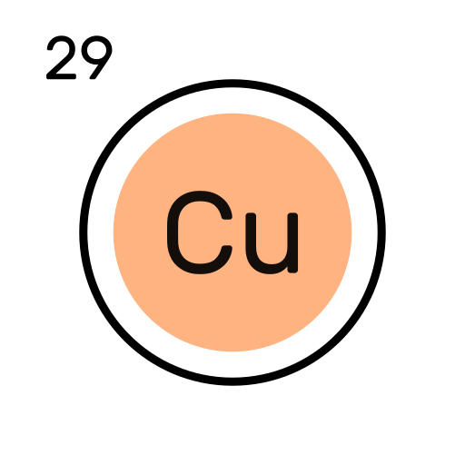

# Industrial Copper Modelling Streamlit App

This Streamlit application is designed for predicting two key aspects of industrial copper transactions: Price and Status. Users can input various parameters related to the copper transaction, and the app will provide predictions based on machine learning models.

## Getting Started

To run this Streamlit app locally or deploy it on a server, follow these steps:

### Prerequisites

Make sure you have the following software and libraries installed:

- Python (3.6+)
- Streamlit
- Joblib
- Numpy
- Scikit-Learn

## Using the App

### Price Prediction

To predict the price of a copper transaction, follow these steps:

1. Select the "Price Prediction" tab.
2. Fill in the following required information:
   - Country
   - Application
   - Item Type
   - Status
   - Product Reference
   - Customer
   - Width
   - Thickness
   - Quantity in Tons
3. Click the "Predict Price" button.
4. The app will display the predicted selling price based on the provided information.

### Status Prediction

To predict the status of a copper transaction, follow these steps:

1. Select the "Status Prediction" tab.
2. Fill in the following required information:
   - Country
   - Application
   - Item Type
   - Product Reference
   - Customer
   - Width
   - Thickness
   - Quantity in Tons
   - Selling Price
3. Click the "Predict Status" button.
4. The app will display the predicted status for the copper transaction.

## Models and Data

The app uses machine learning models for predictions. Pre-trained models (`model_reg.joblib` and `model_Cat.joblib`) and scalar objects (`scaler_reg.joblib` and `scaler_cat.joblib`) are included in the repository. These models were trained on historical data for copper transactions.

